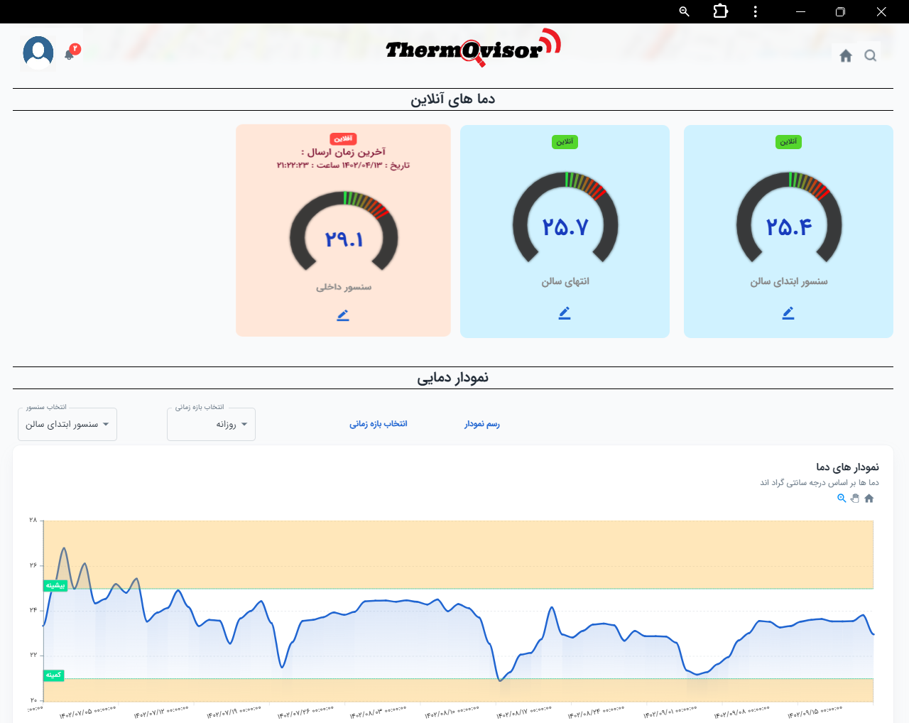

# Environmental and Positional Monitoring Dashboard

Welcome to the repository for my monitoring dashboard website! This dashboard provides real-time insights and tracking capabilities for environmental and positional data transmitted by each device to the server. You can view the live site here:
### LOGO

---

## Overview

This dashboard serves as a centralized interface for monitoring various data streams from connected devices, including:

- **Environmental Data**: Key metrics like temperature, humidity, and air quality.
- **Positional Data**: Real-time tracking of device locations with map integration.

The site offers data visualization, live monitoring, and alerting features, making it ideal for managing and understanding data trends over time.

---

## Preview

Here are some snapshots from the dashboard:
### Device View

### Main Dashboard View

### Data Visualization in Mobile View

---

## Technology Stack

This project is built using:

- **Frontend**: JavaScript with the React framework, providing a responsive and interactive UI.
- **Backend**: ASP.NET, handling server-side logic and data processing.
- **Database**: SQL Server, managed through SQL Server Management Studio (SSMS), for reliable and efficient data storage.

